# Vue_Volunteer项目概述

内蒙古高考志愿填报系统，本系统为计算机毕业设计，前台使用VUE3+Pinia+Router+axios+Element ui为主要技术，涉及一些校正验证引用组件，首先使用node.js配置nest.js框架开发，数据库为mysql8。本项目在开发中，预计有后台管理端，手机端，数据为内蒙古招生考试信息网结网统计获取，禁止用于商业用途

## 项目背景

本项目目前只适用于内蒙古高考报名院校推荐与预测，自2024年6月后，高考改革，项目仅有学习价值

本项目为大学项目毕设，前后台均使用2023年度最新框架，有很大的参考学习价值。

本项目全程使用Type Script

本项目为个人开发，或有些许不足，或有些许BUG，请联系作者，可能会不间断更新

禁止作为比赛项目进行参赛，谢谢合作

# 项目结构介绍

## Node版本

**Node版本18.17.1**

**Api service**

后台文件夹，启动项目请确认在项目api_service目录文件下

安装依赖

```
npm install
```

启动后台

```
npm run start:dev
```

**bcground**

后台管理系统前端文件，启动项目请确认在项目vue-bcgound目录文件下

安装依赖

```
npm install
```

启动项目

```
npm run serve
```

**volunteer文件为sql数据库文件，启动项目前请导入到本地数据库**

其他文件为mit测试相关文件，具体数据已经导入数据库，可忽略

## 数据库结构

数据库共有24张表,但并非全部使用,部分表用于数据分类临时存储

主要数据库关系为

**user->student->options&&mit->school相关表**

学校表分为一本文科学校表,一本文科专业表,二本文科学校表,二本文科专业表;一本理科学校表,一本理科专业表,二本理科学校表,二本理科专业表;成绩-排名对照表;

学校表相关结构如下

```
PreferenceOrder：填报批次信息
CategoryName：科类名称
AdmissionPlanCount：招生计划数量
CollegeName：院校名称
CollegeCode：院校代号
AdmissionRatio：投档比例
LowestScoreAdmissionRatio：比例投档最低分
LowestAdmissionScore：投档最低分
ExpectedApplicantsCount：应投人数
RegisteredApplicantsCount：已报人数
Shortfall_Count：缺档人数
AdmissionRegulationsURL：章程链接

MajorCode：专业代号
MajorName：专业名称
PlanNature：计划性质
PlannedEnrollmentCount：计划人数
MajorLowestAdmissionScore：比例录取最低分
MajorRegisteredApplicantsCount：已报人数
DurationOfStudy：学制年限
TuitionFee：专业学费
LocationOfSchool：办学地点
MajorNotes：专业备注

ranking：排名
```

部分表会取舍其中

## 后端介绍

后端使用node.js搭配nestjs框架开发,配备swagger文档展示,配置接口在main.ts中

```
127.0.0.1:3030/swagger
```

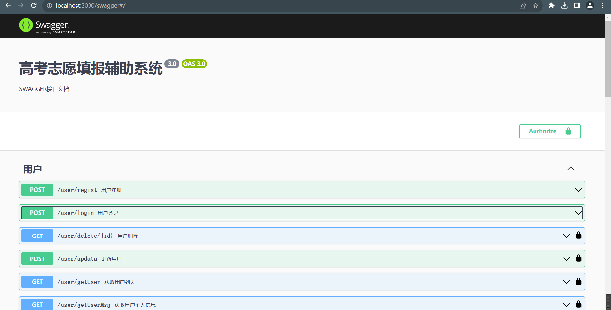

### scr文件为开发文件夹

其中

crypto:密码加密中间件

db:数据库配置文件夹

until:引用加密文件

module:为接口文件夹

每一个自文件夹对应一个模块的接口开发,每个模块包含

```
module:模块文件 entity:实体类文件 service:服务类 controller:控制类
```

所有的子模块都需要在app模块中引入

## 前端介绍

前端使用VUE3+Pinia+TypeScript+Element Plus+Echarts

**src**为开发目录

api:接口管理文件夹

assets:图片

axios:请求响应拦截器配置页面

components:自带未删除

router:路由配置

store:Pinia仓库配置

style:公共样式配置

**views:组件文件夹**,其中layout文件夹为框架页面文件夹

# 项目展示

登陆界面

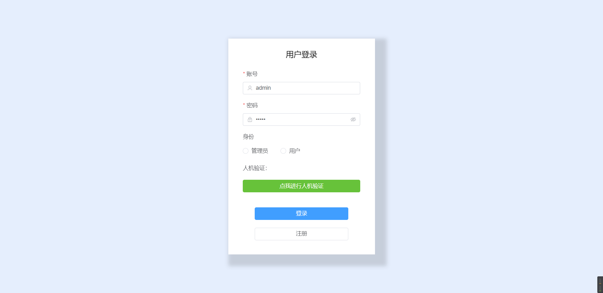

需要进行滑动验证


进入首页，首页数据均从数据库统计获取

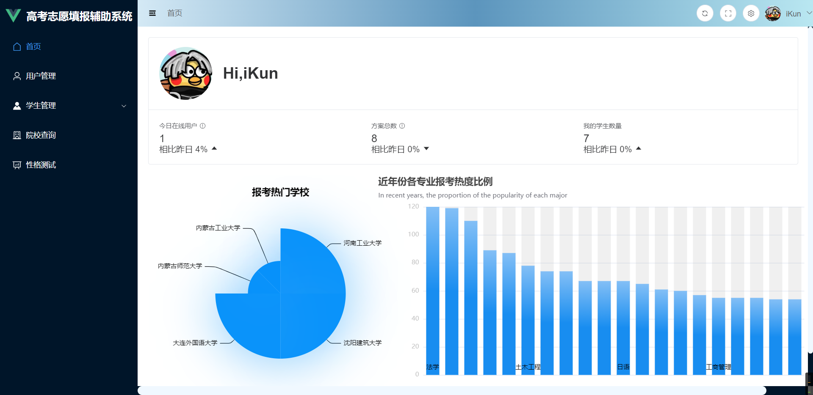

管理员查看，可以对用户进行增删改查

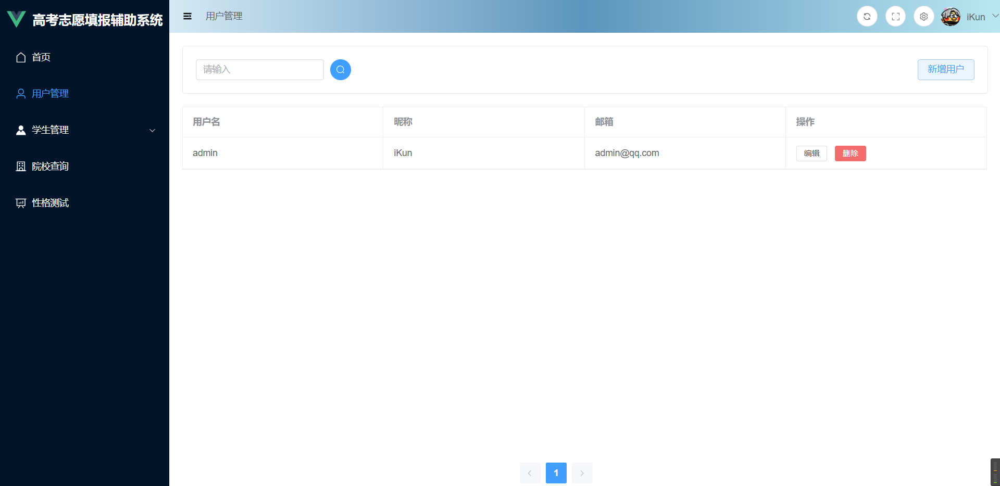

我的学生，只能查看自己ID下的学生信息

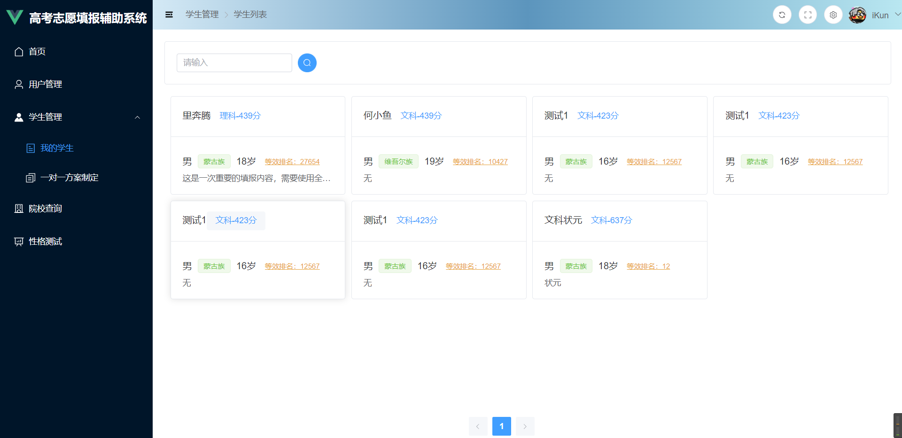

点击学生查看当前学生对应方案

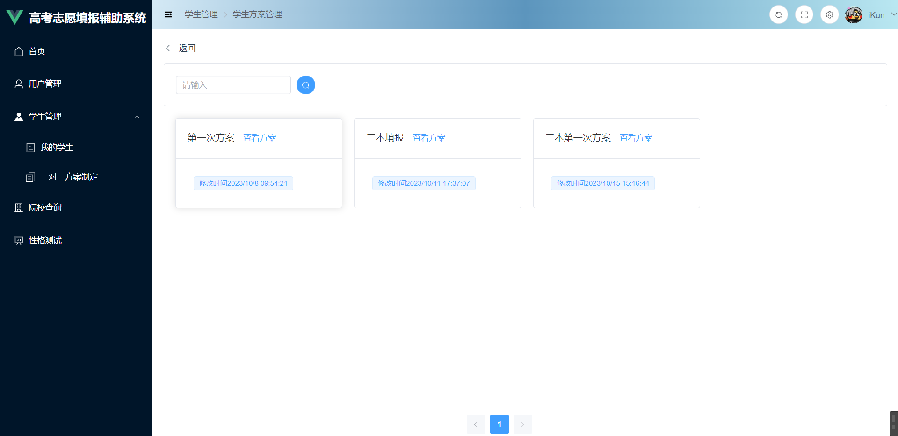

点击方案查看方案中具体学校，右上角可以下载方案（Excel结构未处理，不美观）

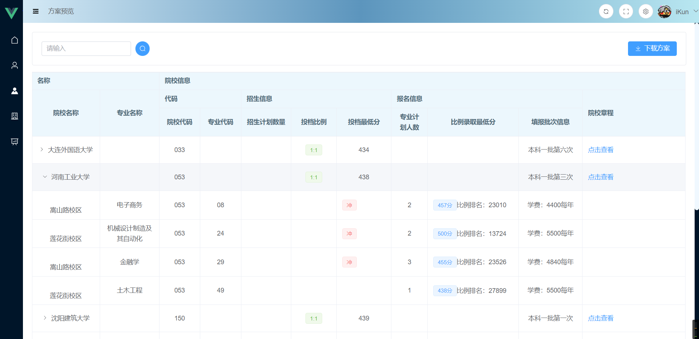

点击一对一填报,可查看学生对应性格测试（后面会讲），以及相关信息

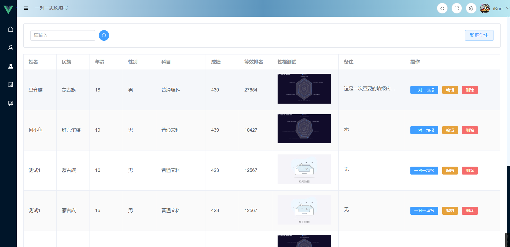

可以对学生进行增删改查，输入成绩后自动获取等效排名

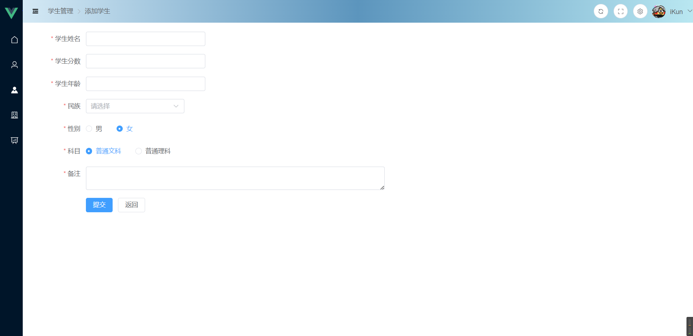

点击某个方案进行添加院校

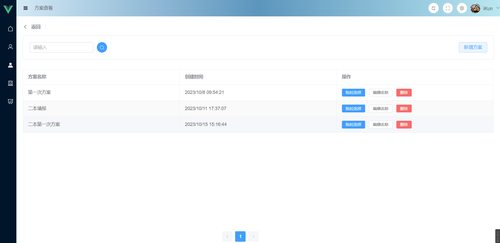

进入选择界面，此界面高效自定义Element plus表格组件，实现单机后方填入表格变色，单机学校填入自动全选专业，点击专业填入自动获取学校，左下角按钮为同步按钮，记得点，不然刷新后数据丢失

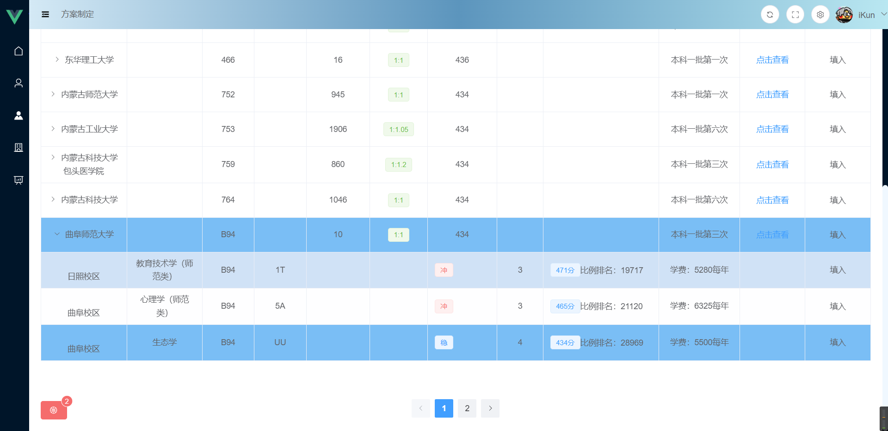

并设置自定义推荐功能，设置 冲！稳！保！三个方面，通过排名百分比推荐

并可上方设置关闭自定义推荐，无法切换文科理科，但是可以切换一本二本，注意，切换一本二本会清空所有历史数据

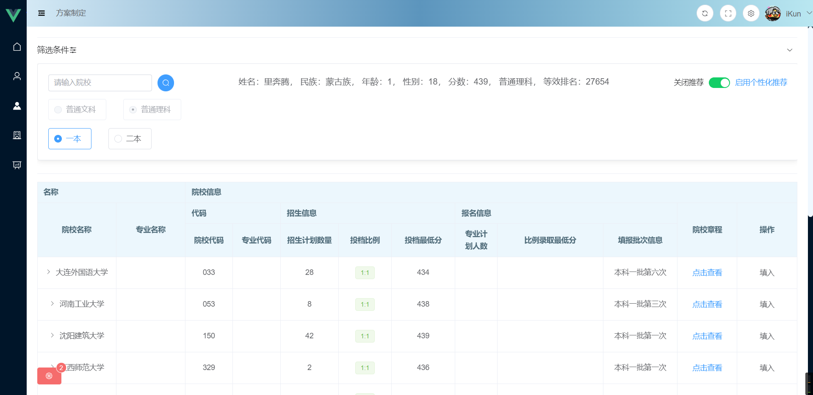

接下来是院校查看，可随意查看院校信息（后方包含院校招生简章）

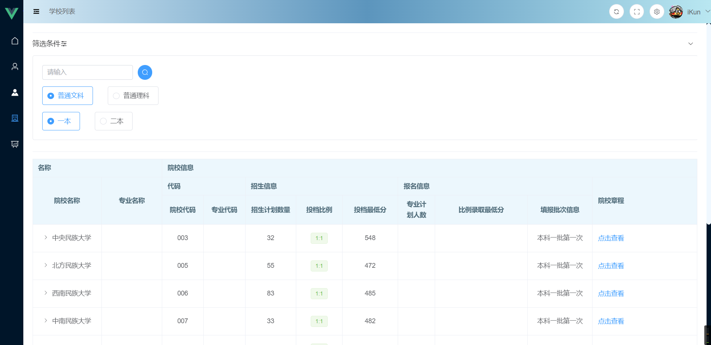

最后是性格测试

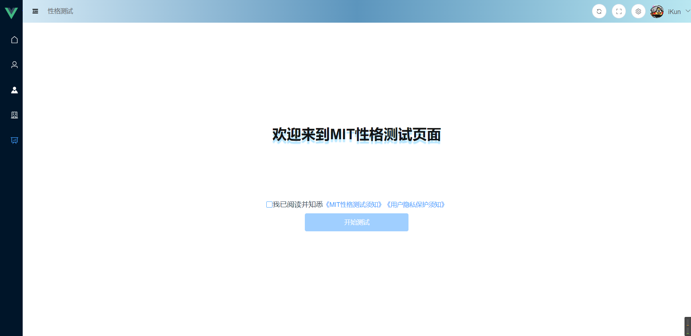

点击开始测试答题，目前只导入12题，后续根据word文档自定义导入即可

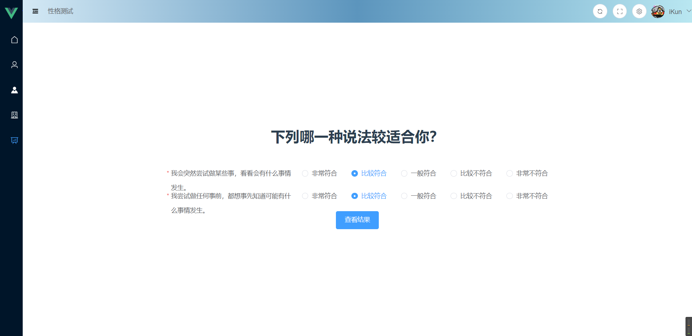

答题完成后返回人格类型，适合专业等

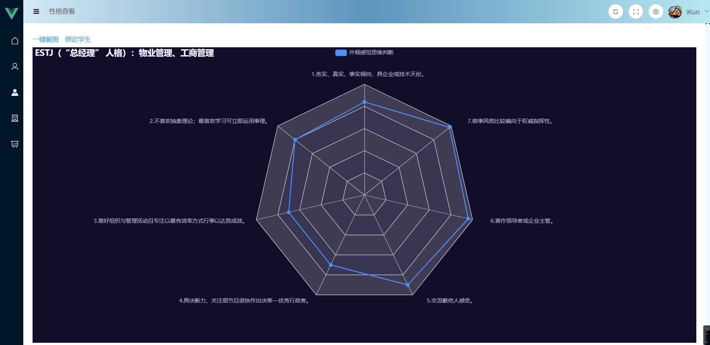

点击左上方一件截图可以直接下载当前组件图片，然后可以选择绑定学生，即可绑定到学生列表后方

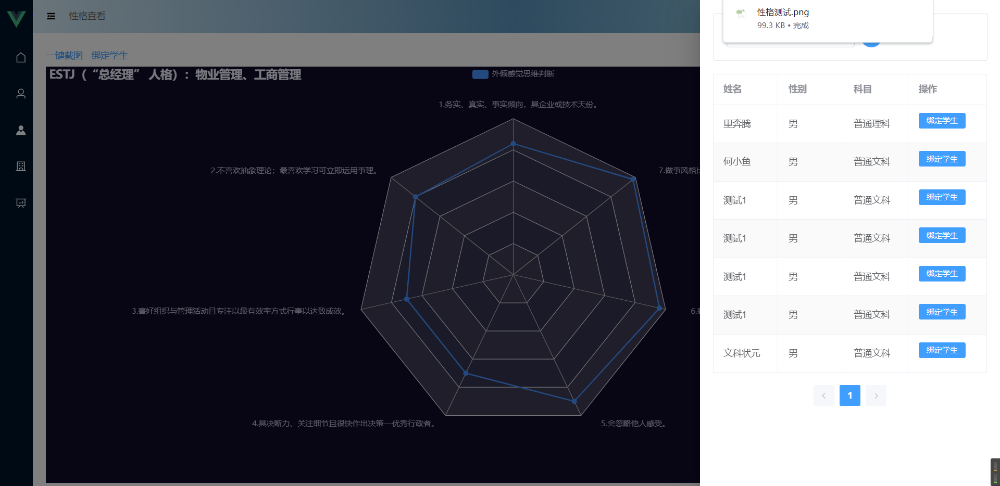

以上为所有功能，如有补充请联系作者

